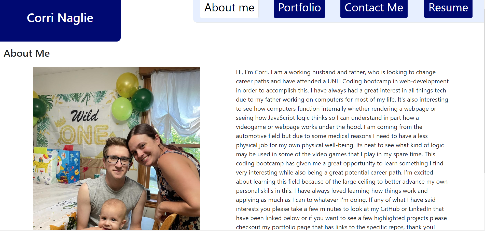

# My React Portfolio

## Description

This is my protfolio made in a react based webpage. There are multiple pages as well as a navigation bar to get between them. The first page is an about me page followed by my favorite projects as well as my contact information and my resume as a pdf.

## Installation

To use locally ...
- Clone the repository from git
- Use command `npm i` to install the dependencies
- use `npm start` to start the application locally 
- Then view the page!

## Usage

This is to display my ability as well as practice with react. It is also a good way to practice keeping a clean filestructure that mantains consistancy in the file structure naming itself. Otherwise it can get very confusing pretty quickly.

## Credits

- [My Github](https://github.com/Irroc)  
- [React](https://react.dev/)   
- [Node.js](https://nodejs.org/en)  
- [Bootstap](https://www.npmjs.com/package/bootstrap)

## Preview Image

